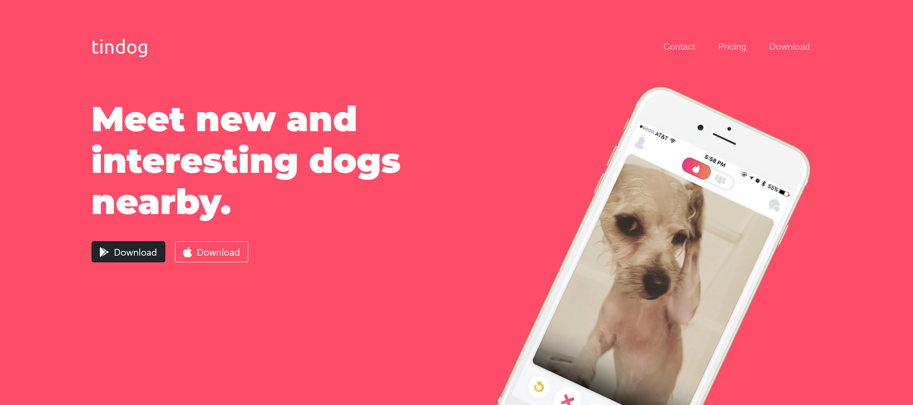

# Tindog Landing Page

## Introduction

Welcome to the Tindog(Tinder for dogs) landing page! This website was created using HTML, CSS, and JavaScript & Bootstrap showcasing the landing page for a dating site example.

## Features

- **Responsive**: The website is designed to adapt to different devices, ensuring an optimal viewing experience on desktops, tablets, and mobile phones.

- **Subscription**: Easily book a table subscription.

- **Contact Information**: Find the restaurant's contact information and location for easy reach.

## Technologies Used

The website was built using the following technologies:

- **HTML**: Used for the overall structure and layout of the landing page.

- **CSS**: Employed for styling and visual enhancements, including the responsive design.

- **JavaScript**: Implemented interactive features and animations.

- **Bootstrap**: For the Ui components and responsiveness.
